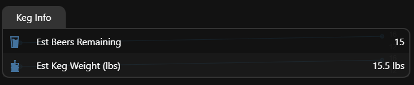
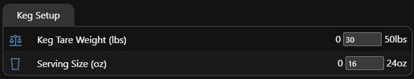

## 🍺 Understanding Keg Readings

Your Keg-a-Weigher display gives you real-time insight into how much beer is left in your keg and how many servings you can expect. Here’s how each value is calculated:




---

### 🍺 Estimated Beers Remaining

This value tells you how many full servings of beer remain in your keg. It uses the following formula:

```
Estimated Beers = (Estimated Keg Weight in lbs × 16) ÷ (Serving Size in oz)
```

This assumes 1 pound of beer is approximately 16 fluid ounces — a simplified conversion that works well for estimating purposes.

**Example:**
- Scale Weight = `80 lbs`
- Tare Weight = `30 lbs`
- Estimated Keg Weight = `50 lbs`
- Serving Size = `16 oz`

```
(50 × 16) ÷ 16 = 50 beers
```

Change the serving size to `24 oz`:

```
(50 × 16) ÷ 24 ≈ 33 beers
```

---

### ⚖️ Estimated Keg Weight (lbs)

This is the amount of beer remaining in the keg, calculated by subtracting the tare (empty) keg weight from the current scale reading:

```
Estimated Keg Weight = Total Scale Weight – Keg Tare Weight
```

**Example:**
- Scale Weight = `80 lbs`
- Tare Weight = `30 lbs`

```
Estimated Keg Weight = 80 - 30 = 50 lbs
```

---

### 🏋️ Keg Tare Weight (lbs)

The tare weight is the empty weight of your keg, without any beer inside. You can adjust this based on your keg size:

- `30 lbs` – Standard Half Barrel (15.5 gal)
- `22 lbs` – Quarter Barrel (7.75 gal)
- `16.5 lbs` – Sixth Barrel (5.16 gal)

This value is subtracted from the total scale weight to estimate how much beer remains.

---

### 🧾 Serving Size (oz)

This is how much beer you pour into each glass. You can adjust this value to match your preferred pour size:

- `12 oz` – Standard can
- `16 oz` – Pint
- `24 oz` – Tall glass or mug

Changing this number updates the **Estimated Beers Remaining** calculation in real time.
